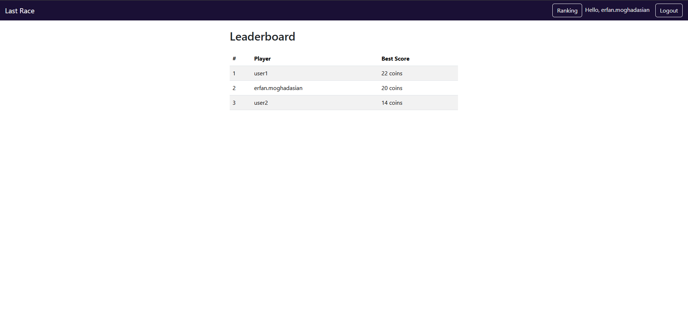
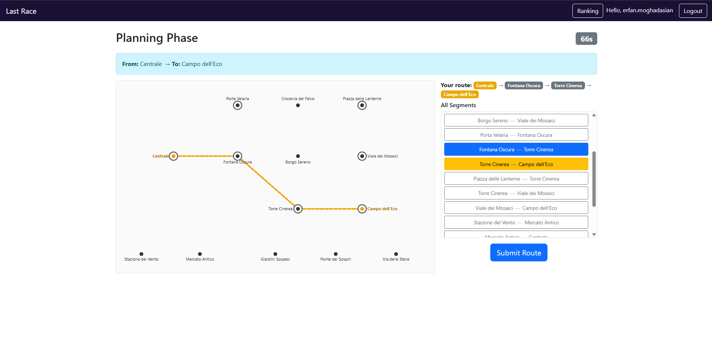

# Exam #1: "Last Race"
## Student: s337136 Moghadasian Erfan

## React Client Application Routes

`/`: home page — shows game instructions. Accessible to everyone (no network map shown to anonymous users).
`/login`: login form — redirects to `/setup` on success.
`/setup`: shows the full network map with all lines and a line legend. Only for logged-in users.
`/play`: the main game — planning, execution, and result phases managed as state. Only for logged-in users.
`/ranking`: leaderboard showing each user's best score. Only for logged-in users.

## API Server

`POST /api/login`
  body: `{ username, password }`
  returns `{ id, username }` or 401 if wrong credentials

`POST /api/logout`
  returns 204

`GET /api/me`
  returns `{ id, username }` if there is an active session, otherwise 401

`GET /api/network` (auth required)
  returns `{ lines, stations, lineStations }` — used in setup and planning to render the SVG map

`GET /api/network/segments` (auth required)
  returns all segments as `[{ stationA, stationB }]` — used in the planning phase segment list

`GET /api/game/start` (auth required)
  returns `{ startStationId, destStationId }` randomly chosen with BFS distance of at least 3 segments

`POST /api/game/submit` (auth required)
  body: `{ route, startStationId, destStationId }`
  validates the route and executes it; returns `{ valid, finalScore, steps }` where each step has `{ from, to, event, effect, coinsAfter }`

`GET /api/game/ranking` (auth required)
  returns `[{ username, best_score }]` sorted by best score descending

## Database Tables

`lines` — metro lines (id, name, color)
`stations` — all stations (id, name)
`line_stations` — which stations belong to which line and in what order (line_id, station_id, position)
`events` — random events that occur during each segment (id, description, effect)
`users` — registered users; passwords stored as scrypt hash + salt (id, username, password, salt)
`games` — each completed game with its score (id, user_id, start_station_id, dest_station_id, score, created_at)

## Main React Components

`App` (`App.jsx`): root component — checks session on load, holds `UserContext`, defines all routes with auth guards.
`Navbar` (`Navbar.jsx`): top navigation bar — shows username, Ranking link, and Logout when authenticated.
`Login` (`Login.jsx`): login form — POSTs credentials and updates `UserContext` on success.
`Setup` (`Setup.jsx`): fetches the full network and renders `NetworkMap` with `showLines={true}` plus a line colour legend.
`Play` (`Play.jsx`): main game component — manages planning (90s timer, segment selection, route building), execution (step-by-step event display), and result phases as a single state machine.
`Ranking` (`Ranking.jsx`): fetches and displays the leaderboard table.
`NetworkMap` (`components/NetworkMap/NetworkMap.jsx`): SVG component built from API data. Renders stations at hardcoded layout positions. With `showLines={true}` draws coloured line segments; with `showLines={false}` shows stations only. Accepts `highlightIds` (start/dest) and `routePath` (selected route drawn as a dashed orange overlay).

## Database Setup

The database is pre-seeded. If you need to reset it, run once before starting the server:

```
cd server
node seed.js
```

## Screenshots



## Users Credentials

| Username | Password |
|---|---|
| user1 | User1@pass |
| user2 | User2@pass |
| erfan.moghadasian | Erf@nmoghadasian1 |

## Use of AI Tools
I used Cursor AI during the project, mainly for UI parts and to understand how sessions work with Passport and how to structure the route validation logic. I reviewed and modified all generated code myself to ensure it matched the specification.
